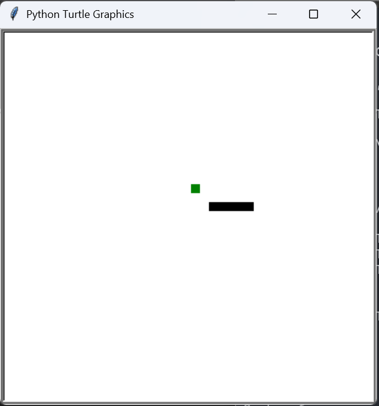

# Snake Game

## Descripción del juego
Este proyecto utiliza el juego Snake, un clásico arcade en el que el jugador controla una serpiente que crece cada vez que come una manzana.  
El objetivo es evitar chocar con las paredes o con el propio cuerpo de la serpiente mientras se acumulan puntos.

El código base fue obtenido del módulo FreeGames de Python, que incluye varias versiones educativas de juegos sencillos desarrollados con la librería `turtle`.

---

## Modificación realizada
En este laboratorio se realizaron cambios gráficos al juego original, manteniendo la funcionalidad intacta.

###  Cambios aplicados:
- **Color de fondo:** cambiado de blanco a **verde**.  
- **Color de la serpiente:** cambiado de negro a **azul**.  
- **Color de la manzana:** cambiado de verde a **rojo**.  

Estas modificaciones se realizaron editando las líneas donde se establecen los colores dentro de la función `move()` del archivo `snake.py`:

```python
turtle.bgcolor('green')
square(body.x, body.y, 9, 'blue')
square(food.x, food.y, 9, 'red')
````


##  Imágenes del juego

### Antes de la modificación



### Después de la modificación


##  Ejecución del juego

Para ejecutar el juego:

```bash
python snake.py
```


---

##  Validación con Flake8

El código fue validado con flake8 para cumplir con las buenas prácticas de estilo en Python (PEP 8).
Después de los ajustes, el archivo `snake.py` no presenta errores ni advertencias de formato.

